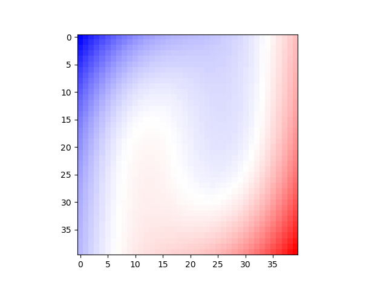

# Deep -- Koopman

### Overview
An implementation of Deep Kooman method idea from [Bethany Lusch' paper](https://www.nature.com/articles/s41467-018-07210-0). At current stage, the code only considers discrete spectrum, but can be extend to continuous specturm easily.

The following figure shows the two basins of attraction from unforced Duffing equation learned by visualizing the eigenfunction $\phi$ that corresponds to Koopman eigenvalue. This numerical result roughly matches theoretical results with only 500 random generated tracks for training. The plot is visualized in two colors (red region has $ \phi > 0 $ and blue region has $ \phi < 0$). The same example is also demonstrated in [Naoya Takeishi's paper](https://arxiv.org/abs/1710.04340)

### Source

`Architecture.py`: contains model architectures.

`Utils.py`: some utility functions.

`train.py`: training script.

`inference.py`: making inferences on data with learned model.
